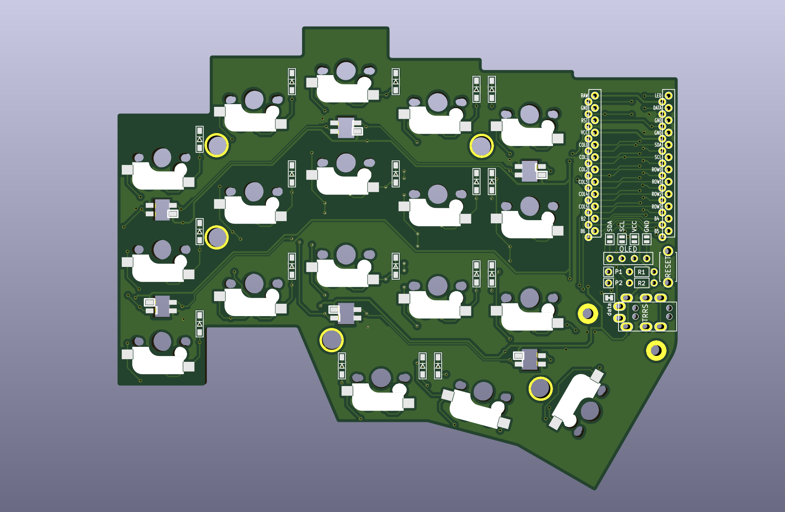

# Fifi Keyboard 🐶 ⌨️
- [Fifi Keyboard](#fifi-keyboard-🐶-⌨️)
  - [TODO](#todo)
  - [Bill of Materials (BOM)](docs/BOM.md)
  - [Building Instructions](docs/BuildInstructions.md)
    - [Build Keyboard](docs/BuildInstructions.md#build-keyboard)
    - [Build Firmware](docs/BuildInstructions.md#build-firmware)

The Fifi keyboard, named after my [🐶](assets/fifi.gif), is a split keyboard with 3x5 column staggered keys and 3 thumb keys, based on foostan's mini-[crkbd](https://github.com/foostan/crkbd/) schematic and thomasbaart's [kyria](https://github.com/splitkb/kyria) layout.

The goal of this project was to build a split keyboard that fits perfectly for the [miryoku](https://github.com/manna-harbour/miryoku) layout with the minimalist style of mini-crkbd and have the aggressive column staggered keys found in kyria. The PCB is reversible, meaning you'll need two of the same PCB to create a full keyboard. It is my first attempt in PCB board design.

## TODO
- Add tent puck support
- Add an additional key in the thumb cluster (support for rotorary encoder)
- Add 3D-printed case