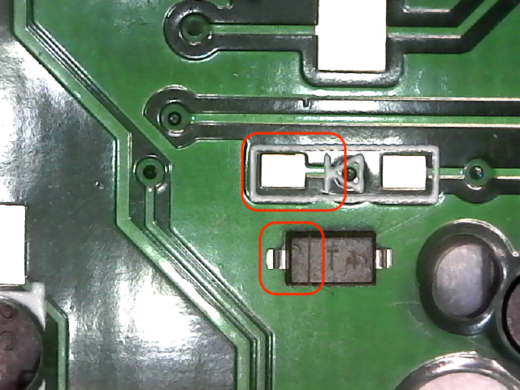
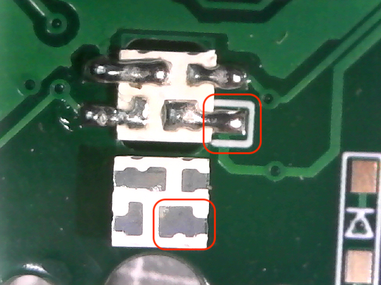
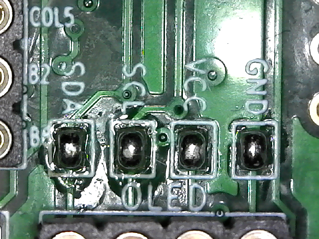

# Build Instructions

- [Build Keyboard](#build-keyboard)
  - [Solder Diodes](#solder-diodes)
  - [Solder Underglow LEDs](#solder-underglow-leds)
  - [Solder Reset Switch, TRRS Jack, and OLED header](#solder-reset-switch,-trrs-jack,-and-oled-header)
  - [Solder OLED jumpers](#solder-oled-jumpers)
  - [Solder Microcontroller](#solder-micro-controller)
  - [Solder OLED Display](#solder-oled-display)
- [Build Firmware](#build-firmware)
  - [QMK Setup](#qmk-setup)
  - [Building miryoku layout firmware](#building-miryoku-layout-firmware)

## Build Keyboard

### Solder diodes
Best to solder the diodes onto the underside of each PCB.

The orientation of the diode is as follows. The line mark on each diode will match the line mark on the silk screen.



The trick is to tin each of the PCB diode's right pad. When ready, melt the tinned pad with the iron and using a tweezer slide the diode in place. It's recommended that you use a reverse tweezer to avoid apply excessive force.

Afterwards solder the other pad. A small amount of solder should suffice. If there is excessive amount of solder, remove it with suction pump or soldering wick.

### Solder Underglow LEDs

The orientation of the LED is as follows. The square shape lead on the back of each LED will match the square outline mark on the silk screen.



Best to set the soldering iron at a low temperature 475 degrees Fahrenheit to avoid burning the LED. Avoid long contact with the LEDs. You can potentially burn the current or the neighboring LEDs.

Here is a [video](https://twitter.com/foostan/status/1005656803818889216) of foostan soldering the LED on crkbd.

### Solder OLED jumpers

Bridge the OLED jumper pads on the upper side of each PCB.



### Solder Reset Switch, TRRS Jack, and OLED header

Solder the reset switch, TRRS jack, and the OLED headers with the components facing on the upperside of each PCB.


### Solder Microcontroller

**Optional** - Solder some low-profile socket headers on the upper side of each PCB.

Or solder the male header directly to the board.

### Solder OLED Display

**Optional** - Solder some male headers on each OLED displays.

[[Back to README]](../README.md)

## Build Firmware

### QMK Setup

Check out QMK official documentation on [Setting Up Your QMK Environment](https://docs.qmk.fm/#/newbs_getting_started).

[[Back to README]](../README.md)

### Building miryoku layout firmware

Add the Miryoku development branch into your existing QMK build environment.

```
git remote add manna-harbour git@github.com:manna-harbour/qmk_firmware.git
git fetch manna-harbour
git checkout --track manna-harbour/miryoku
```

To build for ProMicros, run:
```
make crkbd:manna-harbour_miryoku:flash
```
To build for Elite-C, run:
```
make crkbd:manna-harbour_miryoku:dfu
```

[[Back to README]](../README.md)